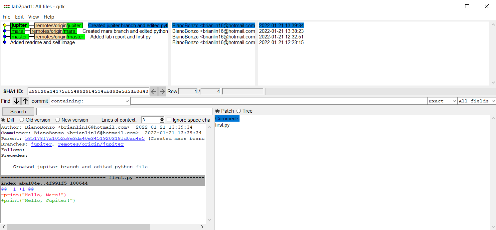
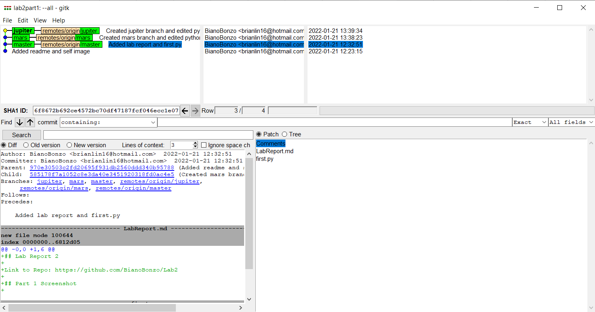
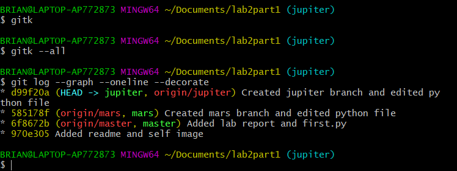
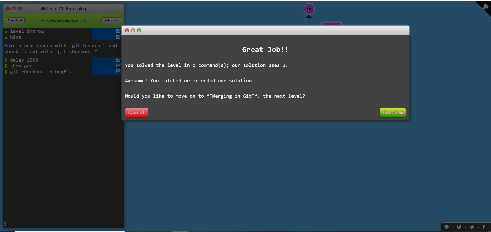
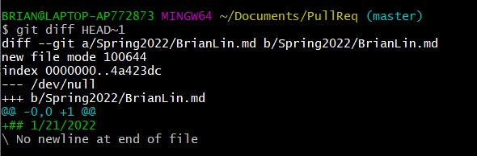
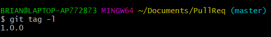

## Lab Report 2

## Part 1

Link to Repo: https://github.com/BianoBonzo/Lab2

Screenshots of ```gitk``` and ```gitk --all```<br/>

<br/>
<br/>


## Part 2

Link to Forked Repo: https://github.com/BianoBonzo/Spoon-Knife

Screenshots of ```Learn Git Branching``` Levels <br/>
<br/><br/>
<br/><br/>
<br/><br/>
<br/>

## Part 3

Link to Forked Repo:  https://github.com/BianoBonzo/PullReq

Screenshot of ```git diff```<br/>
<br/>

Screenshot of ```git tag -l```<br/>
<br/><br/>

Link to Common Repo: https://github.com/BianoBonzo/OSSProjectIdeas